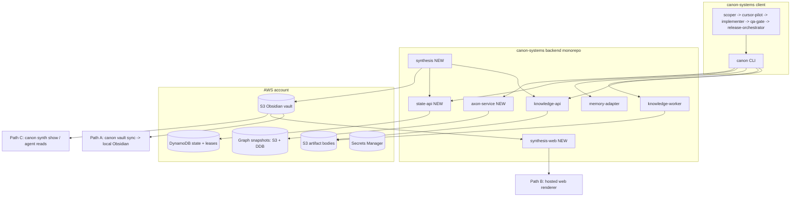

# Canon Memory Platform v1 — Consolidation and Phased Build

## Build Kickoff (executor reads this first, before anything else)

**If you are reading this because the user pressed Build on this plan, do exactly the following, in order, before any other work:**

### Step 0 — Context-window assessment (mandatory first output)

Before making any tool calls, state in plain language:

- Current context budget utilization (rough estimate of used vs available).
- Whether this window carries load-bearing prior chat that is not already in the persisted artifacts below.
- Explicit recommendation: **continue in this window** or **start a fresh window** using the kickoff prompt in "Fresh-window resume" below.

If the recommendation is to start fresh, STOP. Tell the user to open a new window. Do not proceed.

### Step 1 — Hydrate from artifacts only (never from chat)

Read these files in full, in order:

1. This plan file (you are already here).
2. `[docs/MEMORY-PLATFORM-BACKLOG.md](docs/MEMORY-PLATFORM-BACKLOG.md)` — the agent-executable `PROJECT_EXECUTION_PLAN`.
3. `[docs/SYSTEM-WORKFLOW.md](docs/SYSTEM-WORKFLOW.md)` — current runtime contracts.
4. `[docs/MEMORY-PLATFORM-PLAN.md](docs/MEMORY-PLATFORM-PLAN.md)` — target architecture.

Run `canon ask` with a focused query for any prior canonical context on this initiative. Do not rely on chat memory.

### Step 2 — Pre-flight required actions

Before handing anything to `scoper`, perform these three actions, in order:

**2a. Install the hard-lock rule file (first action after Step 0).**

Create `.cursor/rules/memory-platform-build-discipline.mdc` with the exact
content in Appendix A of this plan. This file auto-loads every turn and
mechanically prevents non-markdown writes without valid scoper + cursor-pilot
packets. It must exist and be unmodified before any task execution begins.
This is the only non-markdown-only action permitted before a scoper packet
exists, because this file itself is markdown (`.mdc` is markdown + frontmatter)
and is the precondition for all subsequent enforcement.

**2b. Rewrite the executable backlog.**

Rewrite `[docs/MEMORY-PLATFORM-BACKLOG.md](docs/MEMORY-PLATFORM-BACKLOG.md)`'s `PROJECT_EXECUTION_PLAN` block to match the 7-wave shape in this plan (Wave 0 added, paths retargeted to `backend/`, Read Path 3 aligned with Option X — server renders, auto-pulled into `<repo>/vault/` gitignored). This is the `rewrite_backlog` todo.

**2c. Verify the five living-spec files.**

Verify `[docs/SYSTEM-WORKFLOW.md](docs/SYSTEM-WORKFLOW.md)`, `[README.md](README.md)`, agent templates under `[src/canon_systems/templates/](src/canon_systems/templates/)`, tests under `[tests/](tests/)`, and `[CHANGELOG.md](CHANGELOG.md)` are aligned with the current plan before starting Wave 0. Any drift must be corrected (markdown-only edits).

### Step 3 — Execute via the agent chain, one task at a time

**Do not implement code directly.** For every `task_id`, delegate through the chain:

`scoper -> cursor-pilot -> implementer -> qa-gate -> release-orchestrator`

Your role as parent orchestrator:

- Select the next task from the `PROJECT_EXECUTION_PLAN` respecting `depends_on`.
- Invoke the `scoper` subagent with the task block.
- Persist all packets (including `HANDOFF_NOT_READY` with DoR telemetry) per `[docs/SYSTEM-WORKFLOW.md](docs/SYSTEM-WORKFLOW.md)` §3-§4.
- Drive through `cursor-pilot`, `implementer`, `qa-gate`, `release-orchestrator`.
- Enforce merge gates: QA PASS + `canon qa-validate --require-pass` + `canon qa-validate --require-dor-telemetry` + sampled `canon flow-audit` + CI + `canon memory-health` (once Wave 1 delivers it).
- Advance the task status in the backlog's execution state; then pick the next task.

Skipping the chain and writing code directly is a policy violation that fails `flow-audit`. The only exception is the pre-flight `rewrite_backlog` step above, because the backlog must exist in executable form before `scoper` can consume it.

### Step 4 — Wave boundaries

At the end of each wave (E0 → E1 → ... → E7), re-run Step 0 (context-window assessment) and state the recommendation explicitly before continuing to the next wave.

### Fresh-window resume (paste into a new Cursor window if Step 0 says to start fresh)

```
Resume the canon memory platform build. The plan is at
.cursor/plans/canon_memory_platform_build_d21073e1.plan.md (workspace-local).

Open that file and follow the "Build Kickoff" section from Step 0 onward.
Do not implement code directly; delegate every task to the scoper chain as
required by the plan's execution discipline.
```

---

## Goal

Every Canon agent run — Plan Mode planning, Build Mode chain execution, or
ad-hoc CLI — operates on a single, AWS-hosted, multi-plane memory substrate:

- **Code Graph plane** (hosted Axon service) — structural retrieval, low-token code comprehension.
- **Operational State plane** (checkpoints + leases in DynamoDB) — crash-safe resume, safe concurrency.
- **Historical Knowledge plane** (canonical artifacts, already live) — audit, decisions, DoR telemetry.
- **Human Synthesis plane** (Obsidian-Mind-compatible vault) — operator-facing status.

Everything lives in one repo: `[canon-systems](./)`.

## Target repo shape (post-consolidation)

```
canon-systems/
  src/canon_systems/           CLI (existing) + new subcommands (checkpoint, graph, resume, vault, synth, report)
  backend/
    knowledge-api/             canonical artifacts (consolidated from wherever it lives)
    knowledge-worker/          capture worker (consolidated)
    memory-adapter/            MemPalace-style search (consolidated + fixed)
    state-api/                 NEW: checkpoints + leases (DynamoDB)
    axon-service/              NEW: hosted code graph (fork of Axon, multi-tenant)
    synthesis/                 NEW: canonical+state -> S3 Obsidian vault (absorbs obsidian-mind logic)
    synthesis-web/             NEW: static web renderer for the S3 vault (Path B)
  infra/                       NEW: IaC (CDK or Terraform) for every service + DDB + S3 + IAM
  docs/                        existing + deprecation notes
```

Sibling repos (`canon-platform`, `canon-system-v2`, `mempalace`, `obsidian-mind`, `temporal`, `total_recall`) are left alone during build; only pieces proven in-use by Wave 0 move in. The rest get a deprecation note and are scheduled for deletion after Wave 6.

## Architecture




## Key design decisions (locked before build)

- **Consolidation repo:** `[canon-systems](./)`.
- **Code graph engine:** Hosted Axon (MIT), forked into `backend/axon-service`. Indexing pushed from dev/CI; queries are pure RPC. No local graph state required on agent machines.
- **Operational state substrate:** DynamoDB, accessed through a new `backend/state-api` service. Native conditional writes for optimistic versioning; TTL for lease expiry.
- **Historical knowledge substrate:** existing canonical API + S3 (already working); no substrate change.
- **Human synthesis substrate:** single S3 vault as source of published truth. Server always generates and writes; no client ever writes back. Three read paths consume the same S3 layout:
  - browser via `backend/synthesis-web` (no install, no Obsidian app),
  - agent CLI via `canon synth show` (markdown over HTTPS for agent context hydration),
  - automatic in-repo mirror at `<repo>/vault/` (gitignored) for anyone who wants to open the vault in the Obsidian desktop app — `canon wire` installs a background sync service at login time and adds the `.gitignore` entry; users never run a sync command themselves.
  `obsidian-mind` logic is absorbed into `backend/synthesis` so all three consumers see the same high-quality output.
- **Auth:** continue the current IAM + Secrets Manager + API key pattern already used by `[src/canon_systems/shared.py](src/canon_systems/shared.py)` and `[src/canon_systems/aws_secrets.py](src/canon_systems/aws_secrets.py)`.

## Execution model

Build proceeds in waves. Each wave has tasks sized for the standard chain:

`scoper -> cursor-pilot -> implementer -> qa-gate -> release-orchestrator`

After this plan is approved, `[docs/MEMORY-PLATFORM-BACKLOG.md](docs/MEMORY-PLATFORM-BACKLOG.md)` gets rewritten so its `PROJECT_EXECUTION_PLAN` block matches the waves below (new `backend/` paths, added Wave 0). Project-planner in Plan Mode hands that backlog to scoper one task at a time. Merge gates already enforce QA verdict + `canon qa-validate` + `canon flow-audit` + CI; we add `canon memory-health` as a new required gate in Wave 1.

### Required execution discipline (locked)

These apply to every task in every wave. Non-negotiable; enforced by the existing `flow-audit` / `qa-validate` gates.

1. **Agent chain must be used for each task.** Parent orchestration does **not** implement code directly. For every `task_id`, the work is delegated to the chain: `scoper -> cursor-pilot -> implementer -> qa-gate -> release-orchestrator`. Parent's role is to pick the next task, hand it to `scoper`, persist packets/telemetry, enforce merge gates, and advance to the next task. Skipping the chain and writing code directly is a policy violation that fails `flow-audit`.
2. **Context-window recommendation protocol.** Before starting execution of this plan, and at every wave boundary, the parent orchestrator must assess the current conversation's accumulated context and explicitly recommend to the user whether a fresh context window should be started. Recommendation factors: remaining context budget, artifact-vs-chat ratio, whether prior discussion is load-bearing or already captured in persisted artifacts (plan file, backlog, canonical events). The recommendation is stated in plain language as the first step of any wave kickoff, before any tool calls that would consume new tokens.
3. **Fresh windows resume from artifacts, not chat.** When starting a new context window, the parent must hydrate only from: this plan file, `[docs/MEMORY-PLATFORM-BACKLOG.md](docs/MEMORY-PLATFORM-BACKLOG.md)`, `[docs/SYSTEM-WORKFLOW.md](docs/SYSTEM-WORKFLOW.md)`, canonical memory (via `canon ask`), and checkpoint state (once Wave 2 ships). No assumption that a new window will see the prior chat.

## Waves

### Wave 0 — Inventory and consolidation (blocks everything else)

- Audit `canon-platform`, `canon-system-v2`, `mempalace`, `obsidian-mind`, `temporal`, `total_recall` and find which services back the three URLs consumed by `[src/canon_systems/shared.py](src/canon_systems/shared.py)` — `KNOWLEDGE_API_URL`, `KNOWLEDGE_WORKER_URL`, `MEMORY_ADAPTER_URL`.
- Catalogue `obsidian-mind` specifically: list every synthesis/summary/transform capability it implements, so Wave 5 can absorb the useful logic into `backend/synthesis`.
- Create `backend/` monorepo layout with per-service packages, shared lib for auth + canonical events + IDs.
- Move the in-use services into `backend/`, preserving git history (`git subtree` / filter-repo) where useful.
- Stand up `infra/` that captures what's deployed today (import existing AWS resources, do not rewrite).
- Smoke test: `canon capture`, `canon ask`, `canon dor-log` all pass end-to-end against the consolidated stack.
- Mark obsolete repos in `docs/DEPRECATIONS.md`.

### Wave 1 — Stabilize the present stack

- `canon memory-health` CLI: structured health of canonical, memory-adapter, state-api (stub), axon (stub). Fail-closed on required set.
- Fix `MEMORY_ADAPTER_URL` 404 path in `[src/canon_systems/ask_hybrid.py](src/canon_systems/ask_hybrid.py)`: explicit degraded status, no silent empty hits, queue-and-retry fallback.
- Add `canon memory-health` as required merge gate in `[src/canon_systems/templates/agents/release-orchestrator.md](src/canon_systems/templates/agents/release-orchestrator.md)` and enforce the evidence artifact in `[src/canon_systems/flow_audit.py](src/canon_systems/flow_audit.py)`.

### Wave 2 — Operational state plane (checkpoints + leases)

- DynamoDB table design: single table keyed by `(company_id#repository_id, plan_id#task_id#workstream_id)` with attributes for `phase`, `phase_status`, `state_version`, `lease_*`, `updated_at`. TTL on lease attribute.
- `backend/state-api`: REST endpoints `GET/PUT /state/checkpoint`, `POST /state/lease/acquire|renew|release`. Enforces conditional writes on `state_version` and live lease.
- `canon checkpoint read|write|lease` CLI wrapping the API.
- Agent templates updated to do checkpoint read before work + write after in `[src/canon_systems/templates/agents/*.md](src/canon_systems/templates/agents/)`.
- `canon flow-audit` + `canon qa-validate --require-checkpoints` enforce checkpoint artifacts per phase.

### Wave 3 — Code graph plane (hosted Axon)

- `backend/axon-service`: fork Axon, add company/repo scoping, auth, ingest API accepting graph deltas keyed by `(repository_id, commit_sha)`, versioned snapshots for point-in-time queries.
- Indexing pipeline: `canon graph index` locally pre-push + CI webhook for full reindex on merge. Snapshots stored in S3; query metadata in DynamoDB.
- `canon graph query` and `canon graph impact` CLI.
- Retrieval policy updated in `[src/canon_systems/templates/rules/memory-layer-defaults.mdc](src/canon_systems/templates/rules/memory-layer-defaults.mdc)`: graph first, then state, then canonical, then file reads.
- Retrieval-source telemetry: every agent phase emits a `retrieval_breakdown` canonical event (tokens by source).

### Wave 4 — Crash-safe resume and concurrency

- `canon resume --plan-id <id>`: inspects checkpoints, re-enters chain at first incomplete phase, idempotent.
- Lease + version enforcement wired into `state-api` write path with actionable error bodies.
- Stall watchdog (scheduled job) marks expired leases STALLED and emits unblock canonical event with suggested next step.
- `[docs/runbooks/RESUME.md](docs/runbooks/RESUME.md)` + release gate referencing resume health.

### Wave 5 — Human synthesis plane

Source of truth stays in AWS (canonical + state). The synthesis vault in S3 is the single published output. Three independent read paths consume that same S3 layout — the Obsidian desktop app itself is supported but never required.

- `backend/synthesis`:
  - deterministic summary generator from canonical + state events, keyed by `(plan_id, task_id, cutoff_ts)`, cites `event_id`s.
  - **absorbs the useful logic from `obsidian-mind`** (per Wave 0 catalogue) so summarization/graph-building happens server-side and every consumer benefits uniformly.
  - writes an Obsidian-compatible layout to `s3://canon-synthesis/<company_id>/<repository_id>/<vault_name>/`: markdown with YAML frontmatter, wikilinks, seeded `.obsidian/` config, `attachments/`. Format is Obsidian-compatible by design; running the Obsidian desktop app against it is optional.
  - defines and versions the vault layout spec in `[docs/VAULT-LAYOUT.md](docs/VAULT-LAYOUT.md)`.
  - exposes a `GET /synth/vault/changes?since=<ts>` endpoint for sync clients, plus `GET /synth/show?plan_id=...` for direct markdown reads.
- **Read path 1 — browser** (`backend/synthesis-web`): lightweight web renderer for the S3 vault (Quartz-style or our own). Served at a hosted URL. Zero install. Anyone with access can browse pages, backlinks, graph view, search. No Obsidian app involved. Rebuild-on-publish or request-time SSR chosen in a short spike inside Wave 5.
- **Read path 2 — agent CLI** (`canon synth show --plan-id <id>`): prints markdown for direct read; primary way agents hydrate human-synthesis context during the chain. No browser, no sync.
- **Read path 3 — automatic in-repo mirror + Obsidian desktop** (`canon vault sync`, runs itself):
  - Vault renders **server-side only**. Each release, `backend/synthesis` regenerates the canonical Obsidian-layout vault once, writes to S3. Single writer, concurrency-safe, CI-compatible.
  - Each wired machine receives the vault at `<repo_checkout>/vault/` — inside the repo working directory, **listed in `.gitignore`** so it never gets committed. `canon wire` adds the `.gitignore` entry idempotently.
  - **Automatic pull**: `canon wire` installs a user-level background service (launchd on macOS, systemd on Linux, scheduled task on Windows) that one-way-pulls S3 → `<repo>/vault/` on a short interval (~10s). Starts at login. Users never invoke sync manually.
  - Additionally triggered from the existing Cursor pre-turn hook so a refresh happens before any agent work starts in a session.
  - Optional nice-to-have: release-orchestrator pings a notifier endpoint on `RELEASE_STATUS: PASS` so sync fires near-instantly instead of waiting for the next poll tick.
  - Local folder is read-only from the client's perspective; server is always source of truth, no push-back, no conflicts.
  - Users point the Obsidian desktop app at `<repo>/vault/` and get native Obsidian (plugins, graph view, hotkeys, offline). Obsidian's built-in file watcher picks up changes automatically.
  - Failure mode: offline laptop silently skips; next successful tick catches up. No user action required to recover.
- `canon synth publish` CLI remains the idempotent diff-only S3 write driver used internally by `backend/synthesis`.
- Auto-publish step in `release-orchestrator` template after `RELEASE_STATUS: PASS` so every release refreshes all three read paths simultaneously.
- **Redaction policy:** strict allowlist of safe event fields rendered into the vault; everything else is never written. Allowlist lives in `[docs/VAULT-LAYOUT.md](docs/VAULT-LAYOUT.md)` and is expanded via PR review only. Anything outside the allowlist is dropped silently by the generator.
- **Regeneration timing:** per release only. Vault is regenerated once per successful `RELEASE_STATUS: PASS`, not per task QA PASS. Keeps commit history clean and vault state aligned with published releases. Per-task incremental writes can be added in a later wave if needed.

### Wave 6 — Observability and accountability

- `backend/synthesis` (or separate `backend/metrics`) rollup aggregator over canonical events: lead/cycle time, DoR causes, stalls, retries, token cost by source.
- `canon report --plan-id --since --until --by phase|agent|source` CLI + CSV export.

### Wave 7 — Cleanup

- Delete deprecated sibling repos after grace period.
- Final docs pass across `[docs/SYSTEM-WORKFLOW.md](docs/SYSTEM-WORKFLOW.md)`, `[docs/MEMORY-PLATFORM-PLAN.md](docs/MEMORY-PLATFORM-PLAN.md)`, `[docs/MEMORY-PLATFORM-BACKLOG.md](docs/MEMORY-PLATFORM-BACKLOG.md)`, `[README.md](README.md)`, `[CHANGELOG.md](CHANGELOG.md)`.

## Invariants enforced on every task

- Every CLI touching memory emits the canonical event envelope defined in `[docs/MEMORY-PLATFORM-BACKLOG.md](docs/MEMORY-PLATFORM-BACKLOG.md)` §C.
- Every agent phase does `checkpoint read -> work -> checkpoint write` (enforced from Wave 2 onward).
- Every rejection still produces the DoR telemetry triple from `[docs/SYSTEM-WORKFLOW.md](docs/SYSTEM-WORKFLOW.md)` §4.
- Every behavior change updates the five files required by the living-spec rule.

## What happens right after you approve this plan

1. Rewrite `[docs/MEMORY-PLATFORM-BACKLOG.md](docs/MEMORY-PLATFORM-BACKLOG.md)` `PROJECT_EXECUTION_PLAN` to match these waves (Wave 0 added, paths retargeted to `backend/`, deps updated).
2. Kick off Wave 0 inventory via the scoper chain, one task at a time.
3. Nothing else is touched until Wave 0 smoke test passes.

## Out of scope for v1

- Replacing canonical API internals (still a black box from client POV; we keep it).
- Migrating sibling repos wholesale — only in-use parts move.
- Building a Cursor "Build" button UX — we use the existing Plan -> Build flow; our job is to make it invoke the chain + platform reliably.
- PyPI / CodeArtifact distribution rework.

---

## Appendix A — Rule file to install in Step 2a

Create the following file **verbatim** at
`.cursor/rules/memory-platform-build-discipline.mdc`
as the first action after the Step 0 context-window assessment.

The file uses the `.mdc` extension (Cursor rules format, markdown + YAML
frontmatter). Cursor auto-loads it on every agent turn in this workspace.
This is the mechanism that hard-locks chain usage, phase ordering, and the
no-direct-writes invariant.

### Distribution note

This rule is workspace-scoped. To make it globally available to every Canon
repo, a Wave 7 cleanup task templates it into
`src/canon_systems/templates/rules/memory-platform-build-discipline.mdc` so
`canon wire` distributes it on every new repo wiring. Until then, paste this
rule manually into any repo that should enforce the same discipline.