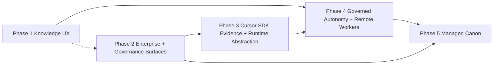

# Canon-systems — prioritized roadmap (May 2026, revised)

**Audience:** operators, founders, product owners, and implementers translating Canon strategy into epics and `PROJECT_EXECUTION_PLAN` entries.

**Estimates:** Calendar-oriented slices for **AI-assisted implementation** (Canon chain + coding agents), **not** staff-hour estimates. Duration varies with scope freeze, security review, runtime choices, and AWS access.

**Companion docs:** [CANON-SYSTEMS-ONE-PAGER-2026.md](CANON-SYSTEMS-ONE-PAGER-2026.md), [CANON-VS-DEVIN-STRATEGY-2026.md](CANON-VS-DEVIN-STRATEGY-2026.md), [CANON-VS-SANDCASTLE-STRATEGY-2026.md](CANON-VS-SANDCASTLE-STRATEGY-2026.md), [CURSOR-SDK-AWS-VALIDATION-2026-05-01.md](CURSOR-SDK-AWS-VALIDATION-2026-05-01.md), [MEMORY-PLATFORM-RUNTIME-AND-AGENTS.md](MEMORY-PLATFORM-RUNTIME-AND-AGENTS.md), [SYSTEM-WORKFLOW.md](SYSTEM-WORKFLOW.md).

**Why this revision exists:** The original roadmap assumed Canon would primarily win as a **Cursor-native full workflow system**. That is still true, but it is no longer sufficient. The current strategy and presentation imply two parallel product truths:

1. **Canon as the full memory + workflow + evidence operating system**
2. **Canon as an extractable governance / control plane** that can sit above other agent runtimes

This roadmap now covers **both**. That is the necessary shape if Canon wants to beat **Devin** on governance + enterprise control and beat **Sandcastle** on product layer without pretending Sandcastle is the same category.

**May 1, 2026 update:** Canon has now validated the first practical remote execution substrate. An AWS ECS/Fargate task invoked the Cursor SDK cloud runtime against `github.com/CanonSystems/canon-systems`, completed a read-only repo analysis, then completed a write-path run that created a branch, commit, and PR. That changes Phase 3 and Phase 4 from "prove remote execution is possible" to "wrap a proven Cursor SDK adapter in Canon evidence, policy, and cleanup semantics."

---

## Non-goals (still non-goals)

- Replacing Cursor’s core chat UI in the short term.
- Matching Cognition’s proprietary model swarm feature-for-feature.
- Becoming “just another agent runtime library” at the expense of Canon’s evidence and governance model.
- Weakening **merge gates**, **packet persistence**, **checkpoint semantics**, or **per-task QA** to chase “more autonomy.”
- Storing long-lived customer secrets in git-tracked files.

---

## Strategic frame

Canon should be planned as **three layers**:

1. **Memory plane**
   - org-scoped context, retrieval, canonical events, cross-repo coherence
2. **Governance / evidence plane**
   - handoffs, checkpoints, DoR, QA gates, release gates, audit trail
3. **Execution plane**
   - where agent work actually runs: local IDE agent, container, remote worker, or hosted workspace

The first two are Canon’s durable moat. The third is partly replaceable.

That means the roadmap must support **two adoption modes**:

- **Mode A — Full Canon workflow**
  - Canon owns the chain end-to-end inside Cursor or a future Canon client.
- **Mode B — Governance-over-external-agents**
  - Teams keep their agent tools/runtime; Canon owns the boundaries that determine whether work counts as real.

If the roadmap only supports Mode A, Canon remains strong against internal power users but weak against Sandcastle-style composability and mixed-agent enterprise reality.

---

## What “winning” means

### Versus Devin

Canon wins by being:

- more governable
- more auditable
- more tenant-correct
- more self-hostable
- more aligned with enterprise evidence and operator control

Canon does **not** need to out-Devin Devin on opaque autonomy. It needs to close enough of the UX and autonomy gap that buyers do not have to give up governance to get leverage.

### Versus Sandcastle

Canon wins by being:

- the system of record for agentic software delivery
- the memory + governance + evidence control plane
- capable of governing multiple execution runtimes, not only its own

Canon does **not** need to out-Sandcastle Sandcastle on being a lightweight TypeScript runtime SDK. It needs a clean runtime abstraction and good integrations so Sandcastle-like flexibility does not leave Canon looking rigid or trapped in one IDE.

---

## Cross-phase dependencies

- **Phase 1 → Phase 4:** Better knowledge UX and playbooks make stronger autonomy cheaper and safer.
- **Phase 2 → Phase 3:** Governance-only adoption needs enterprise-facing policy, audit, and identity surfaces.
- **Phase 3 → Phase 4:** Remote workers and runtime choice only make sense once execution boundaries are explicit.
- **Phase 2 + Phase 4 → Phase 5:** Managed Canon is credible only after identity, runtime control, and governance surfaces exist.

---

## Ordering principle

Ship in this order:

1. **Knowledge people actually use**
2. **Enterprise governance buyers can inspect**
3. **Runtime abstraction + Cursor SDK evidence envelope**
4. **Governed autonomy and remote execution**
5. **Managed Canon**

This is different from “autonomy first.” It is deliberate. Canon’s moat is not raw model cleverness. It is that AI work can be **proven**, **resumed**, **scoped**, **audited**, and **controlled**.

---

## Parallelization (what can run concurrently)

| Track A | Track B | Notes |
| --- | --- | --- |
| Phase 1 P1 (Knowledge UX MVP) | Phase 2 policy + audit surface design | Shared user narratives, low code coupling |
| Phase 2 P2 (admin/audit exports) | Phase 3 Cursor SDK evidence adapter | Audit model should shape adapter contracts |
| Phase 3 P1 (Cursor SDK runtime adapter contract) | Phase 1 P2 (playbooks/macros) | Playbooks inform remote execution packets |
| Phase 4 P1 (remote worker control path) | Phase 2 P3 (event-driven enterprise hooks) | Common concern: external trigger and status model |

---

## Phase 1 — Knowledge and Operator UX (highest leverage)

**Objective:** Make organizational knowledge **discoverable, actionable, and governable** inside the current Cursor loop without weakening tenant boundaries.

### Why this phase matters strategically

- It closes the most visible Devin gap.
- It improves the quality of every later workflow or autonomy feature.
- It keeps Canon’s core story centered on **memory and evidence**, not only process friction.

### Deliverables table

| Priority | Deliverable | Notes |
| --- | --- | --- |
| P1 | **Knowledge Base UX in Cursor** | Browse/search conventions, “when this applies” triggers, macros like `!deploy-checklist`; CLI truth first |
| P2 | **Playbooks** | Promote successful handoff patterns to reusable templates aligned with packet shapes |
| P3 | **Semantic triggers** | Auto-surface knowledge on task text match; bounded, tenant-scoped, injection-reviewed |
| P4 | **Knowledge authoring loop** | Add/edit/deprecate knowledge items with versioning and ownership metadata |

### Must ship (MVP)

- One operator-visible surface to **list**, **open**, and **cite** knowledge items scoped by `company_id` + `repository_id`
- Deterministic macros with argument validation before model expansion
- Authoring docs for adding, versioning, and deprecating knowledge items
- At least one path where the output is directly consumable by agents and by humans

### Nice to have

- In-editor panel or canvas for discovery
- Better ranking beyond token overlap after metrics exist
- Lightweight “why this was suggested” explanation

### Definition of done

- Tenant isolation tests prove no cross-`company_id` / `repository_id` leakage
- `canon ask` or preflight consumes at least one macro and one trigger in an integration test or scripted smoke
- Security review recorded for trigger parsing and retrieval bounds
- CHANGELOG entry and operator runbook updates added

### Repo / code touchpoints

- `src/canon_systems/ask_hybrid.py`
- `src/canon_systems/context_preload.py`
- `src/canon_systems/memory_health.py`
- `backend/memory-adapter/`
- `docs/MEMORY-PLATFORM-RUNTIME-AND-AGENTS.md`

### Risks and mitigations

| Risk | Mitigation |
| --- | --- |
| Triggers pull harmful or irrelevant content into context | Allowlist fields, token budgets, retrieval-source telemetry, QA review on new retrieval paths |
| Knowledge UX becomes Cursor-only and hard to reuse later | Keep CLI/API truth; any UI is a wrapper |

### Milestone checkpoint

**“Phase 1 alpha”**: new engineer opens repo, runs documented command(s), and sees relevant org knowledge for a sample prompt without pasting secrets.

**Rough slice:** 4–6 weeks

---

## Phase 2 — Enterprise Governance Surfaces

**Objective:** Meet **enterprise identity, visibility, policy, and audit** expectations whether Canon owns the whole workflow or only the governance layer.

### Why this phase matters strategically

- It closes enterprise polish gaps versus Devin.
- It turns Canon’s governance story into something buyers can inspect.
- It is prerequisite infrastructure for governance-over-external-agents and for hosted Canon.

### Deliverables table

| Priority | Deliverable | Notes |
| --- | --- | --- |
| P1 | **OIDC / Cognito** | SSO for operators; align with memory-plane auth |
| P2 | **Admin surfaces** | usage, tenant/repo inventory, policy visibility, secret rotation reminders |
| P3 | **Audit export** | JSON / NDJSON export of canonical events and gate outcomes for date windows |
| P4 | **Event-driven hooks** | Linear / Slack / CI -> documented Canon entrypoints |
| P5 | **Policy surfaces** | readable policy definitions for what gates are required and when |

### Must ship (MVP)

- Documented happy path: Cognito or customer IdP -> token usable by knowledge/memory/state HTTP clients
- `canon auth-migration` or successor supports prepare -> canary -> enforce path
- Minimal audit export without raw secrets
- Operator-visible policy surface showing what counts as required evidence for task completion

### Nice to have

- Web admin UI
- Real-time Slack notifications beyond current release-orchestrator behavior
- Policy bundles by environment or team

### Definition of done

- Runbooks updated for login failure and rollback
- At least one automated test or smoke proving anonymous access fails when enforce is on
- Audit/admin surface redacts secrets and identifies who/what/when clearly
- A buyer can understand Canon’s gate model without reading agent prompt files

### Repo / code touchpoints

- `src/canon_systems/auth_migration.py`
- `docs/migrations/cognito-ingress-migration.md`
- `docs/runbooks/auth-migration-rollback.md`
- `src/canon_systems/report_cli.py`
- `backend/knowledge-api/`
- `backend/state-api/`

### Risks and mitigations

| Risk | Mitigation |
| --- | --- |
| Scope creep into a full IAM product | Keep scope on auth + governance visibility, not generalized identity management |
| Enterprise screens become detached from actual Canon packets/events | Build every admin surface off canonical events and real packet/gate state, not shadow models |

### Milestone checkpoint

**“Enterprise-ready pilot”**: one customer-style tenant uses SSO end-to-end on staging and operators can export a one-week audit slice plus inspect required policy/gate state.

**Rough slice:** 5–8 weeks

---

## Phase 3 — Runtime Abstraction and Governance-over-External-Agents

**Objective:** Make Canon govern work even when execution happens **outside Canon’s native agent chain**.

### Why this phase matters strategically

This is the big roadmap gap relative to the current presentation and discussion.

Without this phase:

- Canon is strong only when it owns the workflow
- Sandcastle-style composability looks more flexible
- “Governance as a product category” remains a slide, not a product plan

With this phase:

- Canon can become the **control plane** above mixed runtimes
- governance becomes extractable
- external agents can be adopted without giving up delivery discipline

### Product thesis

Canon should enforce at the **boundaries**, not necessarily inside every agent’s private inner loop.

The portable control points are:

- prompt / task handoff boundaries
- checkpoint / state boundaries
- evidence capture boundaries
- file / commit / PR boundaries
- merge / release boundaries

Anything that wants to count as “done” must pass through Canon-controlled boundaries, even if implementation happened elsewhere.

### Deliverables table

| Priority | Deliverable | Notes |
| --- | --- | --- |
| P1 | **Cursor SDK adapter contract** | formalize the validated AWS ECS -> Cursor SDK cloud path as the first `remote_worker` adapter |
| P2 | **Canon evidence envelope for external runs** | convert Cursor SDK events, CloudWatch logs, branch/commit/PR metadata, and results into canonical evidence |
| P3 | **Governance-only mode** | Canon can run without owning end-to-end prompt orchestration |
| P4 | **Boundary adapter spec** | required handoff, checkpoint, evidence, and gate interfaces for external agents |
| P5 | **External-agent adapters** | Cursor SDK first; then Cursor hooks, GitHub/CI, and other agent flows |
| P6 | **Policy enforcement surface** | declare which boundaries are mandatory for “done” in a repo or tenant |

### Must ship (MVP)

- A written and testable contract for what the Cursor SDK adapter must emit to satisfy Canon governance
- One Cursor SDK happy path where code is produced outside Canon’s native implementer but still passes Canon checkpoints and gates
- One governance-only happy path where code is produced by any external runtime but still passes Canon boundary requirements
- Canon policy says clearly which artifacts are required before PR/merge/release
- Canon can mark work as **non-compliant** when those boundaries are skipped

### Nice to have

- Adapter SDK or lightweight library
- Visual status page showing compliant vs non-compliant work items
- Policy presets for strict vs lighter adoption

### Definition of done

- Cursor SDK read-only and write-path runs complete from AWS and produce valid Canon evidence on disk / in event stream
- At least one non-Cursor external-agent path completes a task and produces the same evidence shape
- At least one negative test proves missing boundary artifacts block merge or release
- Operators can choose between full Canon mode and governance-only mode per repo
- Documentation is clear on what Canon can and cannot enforce inside external agent internals

### Repo / code touchpoints

- `src/canon_systems/checkpoint_cli.py`
- `src/canon_systems/flow_audit.py`
- `src/canon_systems/qa_validate.py`
- `src/canon_systems/report_cli.py`
- `backend/state-api/`
- `backend/knowledge-api/`
- `projects/cursor-sdk-poc/`
- `docs/CURSOR-SDK-AWS-VALIDATION-2026-05-01.md`
- `docs/SYSTEM-WORKFLOW.md`
- `docs/MEMORY-PLATFORM-RUNTIME-AND-AGENTS.md`

### Risks and mitigations

| Risk | Mitigation |
| --- | --- |
| Not all agent tools expose the same hook surface | Govern at stable boundaries: commit/PR/gate/evidence, not every inner step |
| Governance-only mode becomes too weak to matter | Make “done” semantics explicit and enforced at PR/merge/release boundaries |
| Adapter sprawl | Treat Cursor SDK as the reference adapter; require later adapters to emit the same evidence envelope |
| Runtime vendor dependency | Keep the adapter boundary narrow enough that Canon can swap Cursor SDK for another runtime without changing policy or evidence semantics |

### Milestone checkpoint

**“Governance extraction demo”**: a repo uses Cursor SDK or another non-Canon execution path, but Canon still enforces required handoffs, checkpoint/evidence capture, and merge/release gates.

**Rough slice:** 6–9 weeks

---

## Phase 4 — Governed Autonomy and Remote Workers

**Objective:** Increase autonomy and execution power **without** giving up Canon control, by making execution location explicit and by supporting remote subagent workers. The first proven route is Cursor SDK cloud execution launched from AWS.

### Why this phase matters strategically

This is how Canon answers both Devin and Sandcastle cleanly:

- versus Devin: stronger autonomy and cleaner UX without abandoning governance
- versus Sandcastle: runtime sophistication without collapsing into “just an SDK”

It also solves a practical product problem:

- local IDE subagents use the user’s own tool/runtime/token setup
- Cursor SDK cloud execution can now be invoked from Canon-controlled AWS infrastructure
- remote Canon workers give Canon consistent execution, hidden orchestration, and centralized evidence

### Product thesis

Cursor can remain the **user-facing shell** while Canon owns real execution remotely. In the near term, that can mean Canon dispatches through the Cursor SDK rather than trying to replace Cursor's coding runtime immediately.

That means:

- user actions or hooks emit tasks
- Canon workers run the real subagent flow remotely
- Canon returns patches, status, artifacts, or branches
- internal prompts and handoff logic can remain proprietary by default

### Deliverables table

| Priority | Deliverable | Notes |
| --- | --- | --- |
| P1 | **Remote worker execution path** | task packet -> remote worker -> result artifact/diff/status |
| P2 | **Cursor SDK remote worker MVP** | AWS task -> Cursor SDK cloud agent -> branch/commit/PR/result -> Canon evidence |
| P3 | **Long-run implementer mode** | bounded multi-step execution with checkpoints and kill switch |
| P4 | **Parallel worker lanes** | visibility + merge discipline across remote or local execution |
| P5 | **Result return formats** | patch, diff summary, packet, branch, PR, QA result |
| P6 | **Hidden orchestration option** | user sees status/evidence, not raw internal subagent prompt files by default |

### Must ship (MVP)

- One supported Cursor SDK remote worker path that executes a bounded task and returns results into the Canon evidence flow
- Explicit max step / max wall-clock / kill switch bounds
- Checkpoint contract preserved; remote workers cannot skip lease/version semantics
- At least one UX path in Cursor or CLI that feels like “dispatch task -> observe status -> receive result”

### Nice to have

- Dynamic replanning inside worker runtime
- Worker pools by repo or tenant
- Bring-your-own compute target

### Definition of done

- One synthetic epic completes via remote execution with checkpoint evidence and `qa-gate PASS`
- One failure-mode drill proves remote worker crash or timeout leaves resumable state, not ghost completion
- One supported “hidden orchestration” mode still exports enough evidence for regulated customers
- Parallel lanes preserve merge discipline and do not erase per-task packet requirements

### Repo / code touchpoints

- `src/canon_systems/resume_engine.py`
- `src/canon_systems/stall_watchdog.py`
- `src/canon_systems/checkpoint_cli.py`
- `src/canon_systems/templates/agents/*.md`
- `backend/state-api/`
- `backend/knowledge-worker/`
- `backend/knowledge-api/`
- `projects/cursor-sdk-poc/`
- future worker service or hosted execution control plane

### Risks and mitigations

| Risk | Mitigation |
| --- | --- |
| Remote execution feels slow or opaque | Status streaming, explicit artifacts, deterministic return types |
| Hidden orchestration weakens trust | Preserve evidence surfaces and optional prompt inspectability/export |
| Cost or runaway loops grow with autonomy | kill switches, watchdog, step/wall-clock caps, policy by tenant |
| Cursor SDK account, quota, or API terms constrain commercialization | Treat Cursor SDK as the first adapter, not the only adapter; keep provider credentials, rate limits, and task provenance explicit |

### Milestone checkpoint

**“Governed remote execution demo”**: user stays in Cursor, dispatches a coding task to Canon, Canon launches Cursor SDK or another remote worker from AWS, and the user receives a valid result plus packet/evidence trail without local subagents doing the real work.

**Rough slice:** 8–12 weeks

---

## Phase 5 — Managed Canon

**Objective:** Offer hosted Canon for teams that will not run AWS wiring themselves, without diluting the open CLI + repo spine.

### Why this phase matters strategically

- It gives a commercial answer for buyers who want Canon’s control plane but not Canon’s operational setup burden.
- It becomes far more compelling once remote workers and runtime control are real.

### Deliverables table

| Priority | Deliverable | Notes |
| --- | --- | --- |
| P1 | **Canon Cloud** | hosted memory + ingress + dashboards + remote execution control plane |
| P2 | **Customer VPC / isolation options** | parallels enterprise SaaS market expectations |
| P3 | **Predictable pricing** | seat + usage hybrid, not raw ACU framing |
| P4 | **Migration path** | move from self-hosted to managed without losing canonical IDs or evidence history |

### Must ship (MVP)

- Tenant isolation documented and tested at infra boundary
- DPA / region / subprocessors checklist
- Onboarding path from self-hosted to managed without losing `company_id` / `repository_id`
- Hosted path can run the same governance/evidence model as self-hosted

### Definition of done

- Security review or pen-test booked before GA
- Runbooks for incident response and backup/restore
- One design partner running non-production hosted stack with signed evaluation criteria

### Dependencies

- Phase 2 enterprise identity patterns
- Phase 3 runtime abstraction
- Phase 4 governed remote execution

### Risks and mitigations

| Risk | Mitigation |
| --- | --- |
| Managed offer becomes a second truth from the CLI/repo product | Keep canonical IDs, packets, gates, and events identical across deployment modes |
| Hosted execution pressures Canon into black-box behavior | Make evidence surfaces mandatory, even when prompt internals are hidden by default |

### Milestone checkpoint

**“Design partner”**: one non-production tenant running hosted Canon with remote workers and auditable evidence flow.

**Rough slice:** 8–12+ weeks

---

## Cross-cutting product decisions that now need explicit answers

These are not optional anymore; they are roadmap-defining questions.

### 1. What is the minimum boundary contract for “done”?

Canon needs one crisp answer across all modes:

- required handoff artifact(s)
- required checkpoint state
- required evidence citation(s)
- required QA result(s)
- required PR / merge / release gate result(s)

If this is ambiguous, governance-only mode will be mushy.

### 2. What execution return types does Canon support?

Need a product answer for:

- patch file
- working tree diff
- branch
- PR
- QA packet only
- release-status only
- external runtime event stream
- Cursor SDK run metadata

This matters for both remote workers and external agent adapters.

### 3. What is hidden vs inspectable?

Canon can hide:

- internal subagent prompts
- prompt drift details
- remote orchestration internals

Canon must still expose:

- packet/evidence outputs
- gate results
- event trail
- policy compliance state

### 4. How many enforcement modes should exist?

Recommended default:

- **Strict mode**
  - packets, checkpoints, QA gates, merge gates mandatory
- **Adoption mode**
  - lighter requirements, but same event/evidence model underneath

This gives Sandcastle-style adopters a ramp without collapsing Canon’s thesis.

### 5. What is the lifecycle for runtime credentials and PoC cloud artifacts?

The Cursor SDK validation created persistent AWS integration artifacts: Secrets Manager secret, ECR repository/images, ECS task definitions, CloudWatch logs, and a narrow IAM inline policy. The productized version needs:

- explicit secret rotation and revocation flow
- per-tenant credential ownership model
- cleanup command for temporary validation resources
- audit event whenever an external runtime credential is used
- policy for whether customer-owned Cursor credentials are allowed, required, or avoided

---

## Suggested next epics

If starting immediately, cut epics in this order:

1. **Knowledge UX MVP**
2. **Enterprise audit and policy surfaces**
3. **Cursor SDK evidence envelope MVP**
4. **Runtime abstraction contract**
5. **Governance-only boundary adapter MVP**
6. **Remote worker execution MVP**

That order best aligns the roadmap with the deck and the current strategic conversation.

---

## Next step (execution)

1. Break **Phase 1** and **Phase 3 P1/P2** into scoper-ready `task_id`s with acceptance criteria.
2. Turn the validated Cursor SDK PoC into a Canon-native adapter with evidence artifacts and negative tests.
3. Write the **boundary contract** before building additional external-agent adapters.
4. Write the **runtime abstraction contract** before implementing runtime-agnostic remote workers.
5. Revisit this doc after each wave or quarterly, whichever comes first.

---

## Bottom line

Canon should no longer be planned only as “the full workflow solution inside Cursor.”

It should be planned as:

- the **memory plane**
- the **governance and evidence plane**
- and, where useful, the owner of **remote governed execution**

That is the product shape that best incorporates the recent Sandcastle conversation while staying true to the Devin comparison:

- **Devin** pressures Canon to improve autonomy, UX, and enterprise polish
- **Sandcastle** pressures Canon to clarify runtime boundaries and support mix-and-match execution

The roadmap above is the first version that treats both pressures as first-class, without giving up the thesis that makes Canon worth building.

---

*Living doc — revise after each planning cycle, major deck revision, or product strategy shift.*
