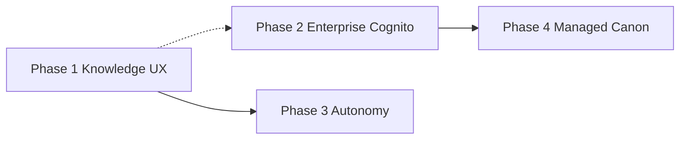

# Canon-systems — prioritized roadmap (Apr 2026)

**Audience:** operators and implementers turning strategy into epics and `PROJECT_EXECUTION_PLAN` entries.

**Estimates:** Calendar-oriented slices for **AI-assisted implementation** (Canon agent chain + coding agents), **not** staff-hour estimates. Duration varies with scope freeze, security review, IdP complexity, and AWS access.

**Companion docs:** [CANON-VS-DEVIN-STRATEGY-2026.md](CANON-VS-DEVIN-STRATEGY-2026.md) (positioning and full comparison table), [MEMORY-PLATFORM-RUNTIME-AND-AGENTS.md](MEMORY-PLATFORM-RUNTIME-AND-AGENTS.md) (runtime contracts), [SYSTEM-WORKFLOW.md](SYSTEM-WORKFLOW.md) (agent packets and gates).

**How to use this roadmap:** Each phase below is a **theme**. Before coding, cut **concrete `task_id`s** with scoper-acceptable ACs; do not treat this file as a substitute for `docs/MEMORY-PLATFORM-BACKLOG.md` or per-task handoff packets.

---

## Non-goals (v1 of this roadmap)

- Replacing Cursor’s core chat UI or becoming a full IDE.
- Parity with Cognition’s proprietary model swarm; focus is **workflow + memory + governance** on top of customer-chosen models.
- Weakening **merge gates**, **packet persistence**, or **per-task QA** to chase “faster” autonomy.
- Storing long-lived customer secrets in git-tracked files (keep AWS Secrets Manager + existing env layering).

---

## Cross-phase dependencies

- **Phase 1 → Phase 3:** Better capture and playbooks make long-run autonomy cheaper and safer.
- **Phase 2 → Phase 4:** SSO, audit expectations, and admin patterns are prerequisites for serious managed selling.
- **Phase 1 and Phase 2** can overlap once Phase 1 **P1** (knowledge UX MVP) is scoped and staffed; avoid starting Phase 4 before Phase 2 **P1** (OIDC/Cognito path) is designed.

---

## Parallelization (what can run concurrently)

| Track A                       | Track B                                          | Notes                                                                           |
| ----------------------------- | ------------------------------------------------ | ------------------------------------------------------------------------------- |
| Phase 1 P1 (Knowledge UX MVP) | Phase 2 planning + IdP discovery                 | IdP work is documents + Cognito console; minimal code until contracts are fixed |
| Phase 1 P2 (Playbooks)        | Phase 3 design (checkpoint schema for long runs) | Design-only for Phase 3 until Phase 1 proves playbook format                    |
| Phase 2 P3 (event recipes)    | Phase 1 P3 (semantic triggers)                   | Shared concern: security review together                                        |

---

## Phase 1 — Knowledge and UX (highest leverage)

**Objective:** Make organizational knowledge **discoverable and actionable** inside the Cursor loop without weakening tenant boundaries.

### Deliverables table

| Priority | Deliverable                                                                                                                  | Notes                                                                   |
| -------- | ---------------------------------------------------------------------------------------------------------------------------- | ----------------------------------------------------------------------- |
| P1       | **Knowledge Base UX in Cursor** — browse/search conventions, “when this applies” triggers, macros (e.g. `!deploy-checklist`) | Sits on MemPalace + canonical events; optional thin API or CLI for CRUD |
| P2       | **Playbooks** — promote successful handoff patterns to reusable templates                                                    | Align with `.cursor/agents` + packet shapes under `.cursor/handoffs/`   |
| P3       | **Semantic triggers** — auto-surface knowledge when task text matches (bounded, tenant-scoped)                               | Mitigate prompt-injection; QA gate any net-new retrieval path           |

### Must ship (MVP)

- One **operator-visible** surface (CLI subcommand and/or Cursor-facing artifact) to **list** and **open** knowledge items scoped by `company_id` + `repository_id`.
- **Macros** implemented as deterministic expansions (prefix + argument validation) before model sees full text.
- **Documentation** for authors: how to add a knowledge item, versioning, and deprecation.

### Nice to have

- In-editor panel (VS Code / Cursor extension or canvas) if product chooses web stack; otherwise defer to CLI + markdown output.
- Automatic suggestion ranking beyond simple match (embeddings) — only after MVP ships and metrics exist.

### Definition of done

- Tenant isolation verified: no cross-`company_id` / `repository_id` leakage in retrieval tests.
- `canon ask` or preflight path can **consume** at least one macro and one trigger in an integration test or scripted smoke.
- Security review note recorded for trigger parsing (injection bounds).
- CHANGELOG entry and operator runbook section added.

### Repo / code touchpoints (starting points)

- `src/canon_systems/ask_hybrid.py`, `context_preload.py` — hybrid ask and preflight.
- `src/canon_systems/memory_health.py` — pattern for probes and env (not all features belong here; avoid bloat).
- `.cursor/rules/memory-layer-defaults.mdc` — document new commands for agents.
- MemPalace / memory adapter contracts: `docs/MEMORY-PLATFORM-RUNTIME-AND-AGENTS.md`, `backend/memory-adapter/`.

### Dependencies

- Stable HTTPS memory endpoints for dev/prod (already required for healthy `canon e2e-check`).
- Optional: small persistence contract if knowledge items move from ad-hoc captures to first-class artifacts.

### Risks and mitigations

| Risk                                       | Mitigation                                                          |
| ------------------------------------------ | ------------------------------------------------------------------- |
| Triggers pull harmful content into context | Allowlist fields, max token budget, QA review for retrieval changes |
| UX sprawl in Cursor rules                  | Keep CLI truth; UI is optional wrapper                              |

### Milestone checkpoint

**“Phase 1 alpha”:** Demo script: new engineer opens repo, runs documented command(s), sees **relevant** org knowledge for a sample prompt **without** pasting secrets.

**Rough slice:** 4–6 weeks of focused AI-led iteration with human gate on UX copy and security.

---

## Phase 2 — Enterprise and Cognito

**Objective:** Meet **enterprise login**, **visibility**, and **automation** expectations without surrendering the self-hosted story.

### Deliverables table

| Priority | Deliverable                                                                  | Notes                                                                                     |
| -------- | ---------------------------------------------------------------------------- | ----------------------------------------------------------------------------------------- |
| P1       | **OIDC / Cognito** — SSO for operators; align with memory-plane auth         | See `docs/migrations/cognito-ingress-migration.md`, `src/canon_systems/auth_migration.py` |
| P2       | **Admin surfaces** — usage, tenant/repo inventory, secret rotation reminders | Read from canonical events + AWS where permitted                                          |
| P3       | **Event-driven hooks** — Linear/Slack/CI → documented `canon` entrypoints    | Recipes first; hosted router later                                                        |

### Must ship (MVP)

- Documented **happy path**: Cognito (or customer IdP) → token usable by knowledge/memory HTTP clients where required by backend.
- `**canon auth-migration`** (or successor) supports phases consistent with production **prepare → canary → enforce** story.
- Minimal **audit export**: JSON or NDJSON of canonical events for a date range (may reuse `canon report` patterns).

### Nice to have

- Full web admin UI.
- Real-time Slack notifications beyond what release-orchestrator already describes in templates.

### Definition of done

- Runbook updated: login failure, rollback (`docs/runbooks/auth-migration-rollback.md` extended or linked).
- At least one **automated** test or smoke that fails if anonymous access reaches protected routes when enforce phase is on (where applicable).
- Admin surface or export **does not** print raw secrets; redaction rules documented.

### Repo / code touchpoints

- `docs/migrations/cognito-ingress-migration.md`
- `src/canon_systems/auth_migration.py`
- `docs/runbooks/auth-migration-rollback.md`
- Infra references in `infra/` and `docs/MEMORY-PLATFORM-RUNTIME-AND-AGENTS.md` (ingress, HTTPS).

### Dependencies

- DNS + TLS for stable memory hostname (already a recurring requirement).
- Legal/privacy sign-off if admin surfaces show user-identifiable telemetry.

### Risks and mitigations

| Risk                                 | Mitigation                                                    |
| ------------------------------------ | ------------------------------------------------------------- |
| IdP misconfiguration breaks all devs | Canary phase, rollback runbook, feature flags per environment |
| Scope creep into full IAM product    | Limit Phase 2 to operator/auth + read-mostly admin exports    |

### Milestone checkpoint

**“Enterprise-ready pilot”:** One customer-style tenant uses SSO end-to-end for memory-plane traffic on staging; operators can export an audit slice for a single week.

**Rough slice:** 5–8 weeks depending on IdP complexity and compliance review.

---

## Phase 3 — Autonomy layer (without dropping governance)

**Objective:** Increase **duration and parallelism** of agent work while **packets, QA, and merge gates** remain the source of truth for shipping.

### Deliverables table

| Priority | Deliverable                                                    | Notes                                                                       |
| -------- | -------------------------------------------------------------- | --------------------------------------------------------------------------- |
| P1       | **Long-run implementer mode** — multi-step with checkpoints    | Feature-flag per repo; merge-sensitive work still needs QA packet           |
| P2       | **Parallel implementer lanes** — visibility + merge discipline | Align with `.cursor/rules/memory-platform-build-discipline.mdc` multilane § |
| P3       | **“Playbook from session”** — export wave to template          | Depends on Phase 1 playbooks                                                |

### Must ship (MVP)

- Checkpoint **read/write** contract preserved (`canon checkpoint` + state-api when configured); long-run mode **cannot** skip lease/version semantics.
- Explicit **kill switch** and **max step** / **max wall-clock** bounds for autonomous stretches.
- Documentation for parents: when to use long-run vs serial chain.

### Nice to have

- Dynamic replanning inside cursor-pilot (high complexity; separate epic).

### Definition of done

- At least one **integration or simulation** test proving two concurrent checkpoint writers hit **version conflict** path correctly.
- QA packet still produced before merge for repos under strict rule sets.
- Release notes: operational limits and failure modes.

### Repo / code touchpoints

- `src/canon_systems/checkpoint_cli.py`, `resume_engine.py`, `stall_watchdog.py`
- `.cursor/agents/implementer.md`, `cursor-pilot.md`, `qa-gate.md`
- `docs/MEMORY-PLATFORM-BACKLOG.md` checkpoint schema section

### Dependencies

- Phase 1 playbooks (or minimal template format) for repeatable long-run instructions.
- Stable state-api availability for teams that enable it (fail-open behavior documented for local dev).

### Risks and mitigations

| Risk                   | Mitigation                                                                 |
| ---------------------- | -------------------------------------------------------------------------- |
| “Autonomy” bypasses QA | Hard gate in release-orchestrator + CI policy                              |
| Runaway cost / loops   | Caps, watchdog, stall events already in platform — wire into long-run mode |

### Milestone checkpoint

**“Governed autonomy demo”:** One synthetic epic completes multiple implementer steps with **checkpoint evidence** and ends with **qa-gate PASS** artifact on disk.

**Rough slice:** 6–10 weeks; overlaps Phase 2 slightly.

---

## Phase 4 — Managed Canon (optional commercial path)

**Objective:** Offer **hosted** Canon for teams that will not run AWS wiring themselves, without diluting the open **CLI + repo** experience.

### Deliverables table

| Priority | Deliverable                                                                 | Notes                                                     |
| -------- | --------------------------------------------------------------------------- | --------------------------------------------------------- |
| P1       | **Canon Cloud** — hosted memory + ingress + dashboards; customer VPC option | Parallels managed SaaS + Enterprise VPC stories in market |
| P2       | **Predictable pricing** — seat + usage hybrid (not raw ACU-only)            | Finance/legal dependent                                   |

### Must ship (MVP)

- **Tenant isolation** at infra boundary (account, VPC, or equivalent) documented and tested.
- **Data processing agreement** checklist (customer subprocessors, regions).
- Onboarding path: **export** or **migrate** from self-hosted to managed without losing `company_id` / `repository_id` semantics.

### Definition of done

- Pen-test or security review slot booked before GA (per company policy).
- Runbooks: incident response, backup/restore expectations, customer support escalation.

### Dependencies

- Phase 2 enterprise identity patterns (SSO) almost always required for serious buyers.
- Billing integration (Stripe or enterprise invoicing) — outside core canon-systems repo but blocks GA.

### Risks

- Operational burden on CanonSystems org; mitigate with SLOs and limited preview cohort.

### Milestone checkpoint

**“Design partner”:** One non-production tenant running hosted stack with signed evaluation criteria.

**Rough slice:** 8–12+ weeks; often parallel to Phase 2–3 after architecture review.

---

## Ordering principle

Ship **Phase 1** before betting heavily on autonomy: better knowledge UX increases capture quality and makes later phases cheaper.

---

## Next step (execution)

1. Break Phase 1 into `**task_id`s** with acceptance criteria (scoper-ready).
2. Align first epic with `handoff_id` / wave branch policy in `.cursor/rules/memory-platform-build-discipline.mdc` if work is Canon Memory Platform–scoped.
3. Revisit this doc **after each wave** or quarterly.

---

*Living doc — revise after each planning cycle.*